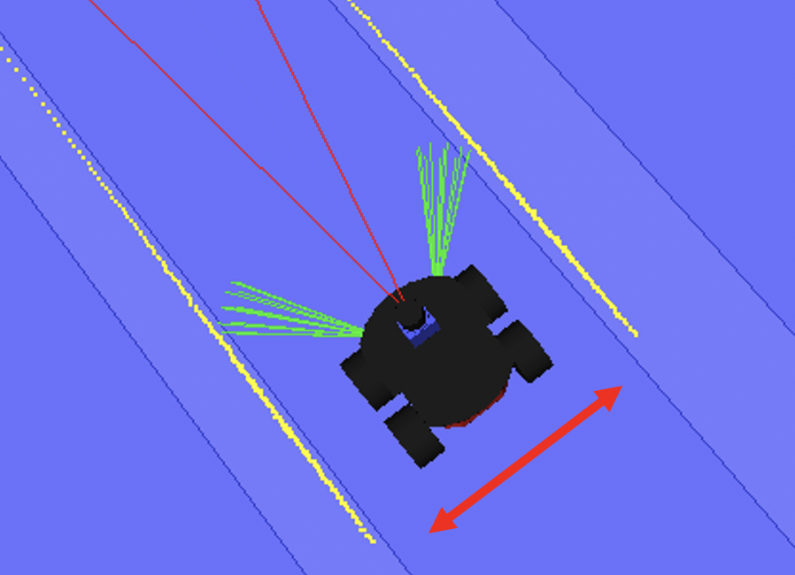
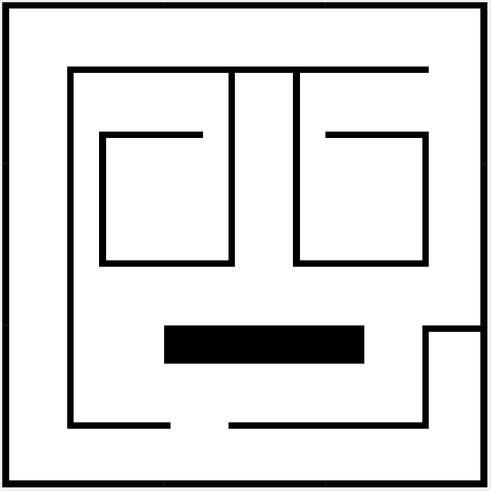
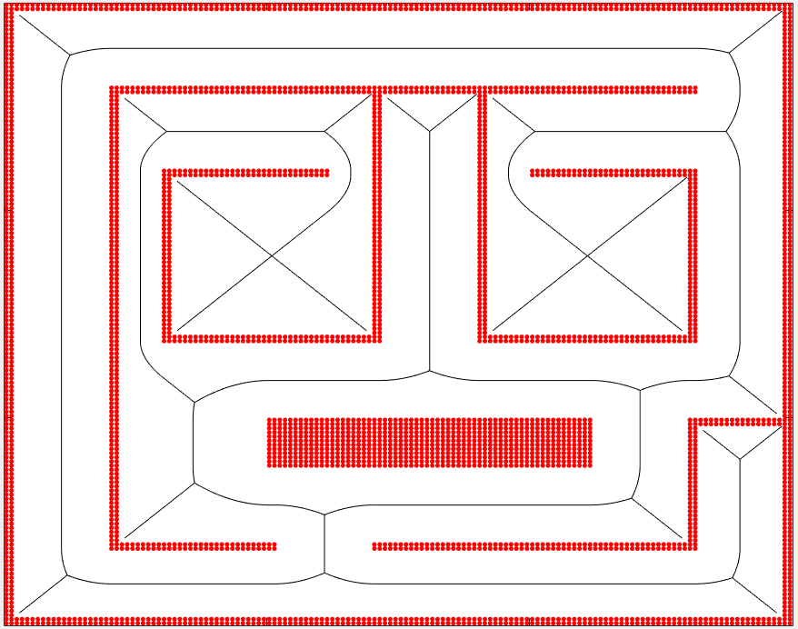

<h3>Sistema de navegación para un robot autónomo móvil</h3>
El código almacenado en este repositorio simula y permite la navegación de un robot móvil de forma autónoma. Para ello se ha creado un entorno virtual XML para la interfaz experimental Apolo. Es posible establecer una ruta para que el robot patrulle el mapa de forma cíclica o definir misiones temporales a partir de objetivos puntuales. La navegación del robot es reactiva. El planificador de trayectorias cuenta con un mapa del entorno precargado a partir del cual se hace la planificación offline. La ruta diseñada por el planificador se basa en el diagrama de Voronoi del entorno. En el momento en que el robot detecta un obstáculo inesperado que no le permite seguir la ruta offline establecida, recalcula la trayectoria de forma online paras esquivar el obstáculo.  

Representación del robot móvil:  

 
Mapa del entorno:  

 
Trayectoria offline basada en Voronoi:  

**Ejemplos de navegación del robot:**  
-Vuelta de reconocimiento con obstáculos inesperados:  
https://www.youtube.com/watch?v=N3qLEpVvDxs&t=6s  

-Recorrido sin obstáculos inesperados:  
https://www.youtube.com/watch?v=YiZZcJ9YF4U  

-Pasillo estrecho:  
https://www.youtube.com/watch?v=zwjWW0sZss8  
